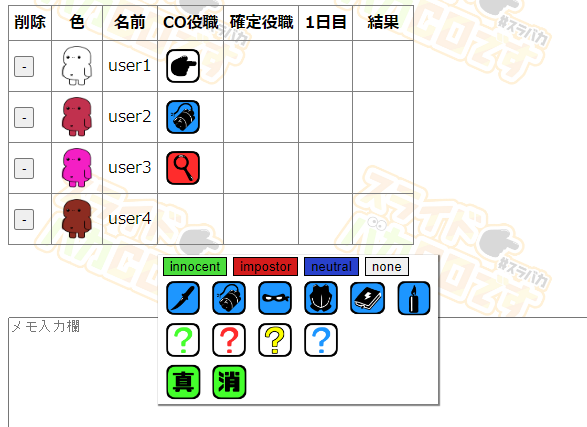

# FeignTest.github.io

## はじめに
このFeignTestは、知人から依頼されたFeignをより良く遊ぶために用意したhtml,js,cssです。 
自分はjavascript,html,cssはまだ疎くほとんど独学のため（ネットの情報使用しまくり）、もっとこうすればいいや、コードが乱雑になってしまっているなどあるかもしれませんが。 
自分なりに調べ実装したものたちになります。 
気が向いたり要望あれば更新するかもしれませんが、基本最初に求められたものまで実装できれば更新はしない予定です。 
jQueryも使ってみたかったんだけどそこまで余裕がなく。 
まずはjavascriptとhtml,cssの理解がしたくて基本それだけでの実装で行いました。 

スマホには未対応です...。 
操作保証対象外です。 

## 対応ブラウザについて
自分の手元でのOpera,Chromeの動作は確認済みです。

## 使い方
※updateが入っていて画像が異なる場合があります。 

【色】プレイヤーカラーを選択することができます 

【名前】プレイヤー名を入力することが出来ます 
　　　　一括user登録で一括で入力することも可能です 
　　　　例） 
　　　　1人目 
　　　　2人目 
　　　　3人目 
入力済みの名前をクリックすることで変更可能です。 
※同一の名前を複数登録はできません 

【CO役職】プレイヤーがCOする役職を選択することができます 
未選択をクリックすることで入力をリセットすることが出来ます 
【確定役職】スライドや吊られたり死んだりした人の役職を入力することが出来ます 
未選択をクリックすることで入力をリセットすることが出来ます 

【1日目】役職行動を行ったプレイヤーのカラーを選択することが出来ます 

【結果】役職行動からその結果を入力することが出来ます 

【翌日】クリックすると1日プラスされます 
【reset】入力したものの全てがリセットされます 
【日数リセット】1日以降の日にちがリセットされます 

行をクリック長押しで任意の行と入れ替えることが出来ます（スマホは対応しておりません） 

## 連絡先
[プログラマーTwitter](https://twitter.com/usami_homare)

[知人Twitter](https://twitter.com/x_H_N_R_x)

## 現状発覚してるバグについて
- OperaGXの特定環境だとUserの並べ替えをすると罫線が太くなる。
  - 自分の手元で再現できず

## アプデ予定のやつ
- 説明文追加

## 余裕があればアプデ予定のやつ
- 罫線が太くなるバグ修正。
- 真ん中揃えが出来てない箇所が多いので真ん中揃えを出来れば...。
  - やり方はある程度確立してるが別バグを生む可能性が高く手を出してない。
- 選択のウィンドウが下にずれてしまう。
  - 原因は発覚してるが修正方法が不明瞭で色々と模索中。
